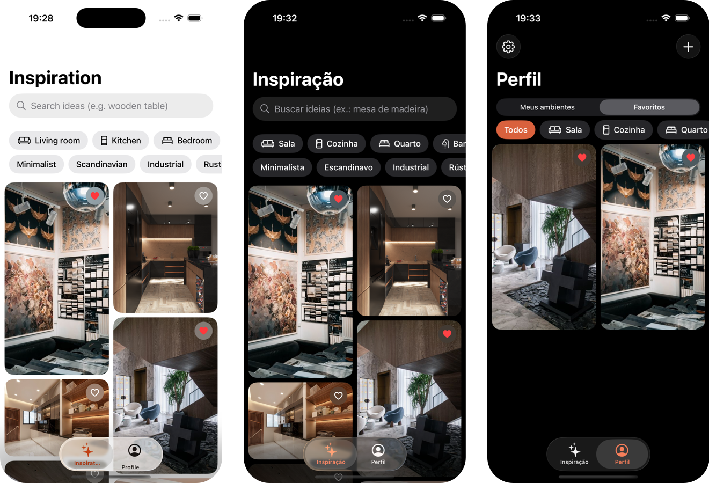

<div align="center">


### Roomspire

**Room-by-room decor inspiration. Written in native iOS, by hand, to learn UIKit, SwiftUI and how an iOS app is actually put together.**

UIKit shell · SwiftUI screens · MVVM · SwiftData · custom `Layout` · en / pt-BR · dark mode


</div>

---

## The app



Search interior photos, combine filters the way Pinterest does not let you
(room × style × colour), favorite what you like, and keep photos of your own
rooms tagged by room and style. Two languages, light and dark, everything on
device.

---

## Why this project exists

I come from React Native ([Aluza](https://github.com/gustavo-em/aluza) is on
the App Store). I wanted to know what happens under the bridge: how a view
controller lives, why a table view recycles cells, what a delegate really is,
how SwiftUI and UIKit share one screen, and where data lives on an iPhone.

So there is no storyboard, no template code left standing and no UI library.
Every screen started from an empty `UIViewController` and moved on only after
the previous concept worked. The commit history is the learning path, in
order:

1. Drop the storyboard and create the window in code
2. Build the rooms list with `UITableView`, a SwiftUI cell and a view model
3. Show room details in a sheet hosted from UIKit
4. Add a tab bar with SwiftUI screens
5. Load Pexels photos into a masonry feed with equalized blocks
6. Add search with room, style and colour filters
7. Save your own room photos with `PhotosPicker` and SwiftData
8. Favorite feed photos and show them in the profile
9. Localize in English and Portuguese, add dark mode

---

## What it does

| Screen          | What is there                                                                                                                  |
| --------------- | ------------------------------------------------------------------------------------------------------------------------------ |
| **Inspiration** | Pexels search behind a native search bar, chips for room, style and colour, 400 ms debounce, masonry grid in blocks of equal height, pull to refresh, heart to favorite |
| **Profile**     | *My rooms*: photos from the library, downscaled and tagged, stored with SwiftData. *Favorites*: the hearts from the feed, filterable by room. Language and appearance in a menu |
| **Details**     | Sheets for your own photo (editable note, delete) and for a favorite (photographer, share, open on Pexels)                     |

---

## Stack

| Concern       | Choice                                            | Why                                                                  |
| ------------- | ------------------------------------------------- | -------------------------------------------------------------------- |
| App shell     | **UIKit**: `SceneDelegate`, `UITabBarController`  | To own the window and the tab bar in code instead of a storyboard    |
| Screens       | **SwiftUI** inside `UIHostingController`          | The way most real apps mix the two today                             |
| State         | `@Observable` view models, `@State`, `@AppStorage` | iOS 17+ observation, no Combine                                     |
| Layout        | A custom `Layout` (`EqualizedMasonryLayout`)      | `LazyVGrid` aligns rows; Pinterest does not                          |
| Networking    | `URLSession` + `async/await` + `Codable`          | Nothing to install; `URLComponents` builds the query                 |
| Persistence   | **SwiftData** (`@Model`, `@Query`, `#Predicate`, `#Unique`) | Own photos with `.externalStorage`, favorites with a unique id |
| Photos        | `PhotosPicker`, `byPreparingThumbnail`, Core Graphics | Picker needs no permission; resize and average colour off the main thread |
| Localization  | String Catalog, `.environment(\.locale)`          | Switch language in-app without restarting                            |
| Icons         | SF Symbols, `SFSafeSymbols`                       | Type-safe symbol names                                               |

---

## Architecture

UIKit owns the process and the tab bar; each tab is a SwiftUI tree with its
own `NavigationStack`. Screens talk to view models; view models talk to the
network and to SwiftData; nothing in a `View` knows what a `URLRequest` is.

```
SceneDelegate ──> MainViewController (UITabBarController)
                    ├── AppRoot { HighlightsView }   SwiftUI, own NavigationStack
                    └── AppRoot { ProfileView }      SwiftUI, own NavigationStack
```

```
RoomInspiration2/
├── MainViewController.swift      Tab bar, hosting controllers, appearance
├── Models/
│   ├── DecorFilters.swift        RoomType · DecorStyle · PhotoColor · SearchCriteria
│   ├── UserPhoto.swift           @Model, image in external storage
│   └── FavoritePhoto.swift       @Model, #Unique photoID, toggle with FetchDescriptor
├── Scenes/
│   ├── HighLights/               Feed view + view model (search, filters, blocks)
│   ├── Profile/                  My rooms, favorites, add photo, two detail sheets
│   └── ListRooms/                The first UIKit table view, kept as reference
├── Components/
│   ├── EqualizedMasonryLayout    The Layout protocol: N rows per column, equal height
│   ├── PhotoCard · LocalPhotoCard · FilterChip
│   └── Color+Hex
└── Support/
    ├── Persistence               One ModelContainer for every hosted screen
    ├── ImageProcessor            nonisolated resize, JPEG, average colour
    ├── AppLanguage · AppSettings In-app locale and appearance
    └── Array+Chunked
```

### Things worth opening

- **`EqualizedMasonryLayout`** implements `sizeThatFits` and `placeSubviews`.
  Each block has N photos per column; the shorter column is stretched so both
  end at the same height, and the stretch is spread over N photos, never one.
  No `GeometryReader`, spacing included in the math.
- **Debounce without a library.** `.task(id: viewModel.criteria)` cancels the
  previous task whenever text or a chip changes; the request only starts after
  400 ms of silence, and a late response for an old query is dropped.
- **`FavoritePhoto.toggle`** is a `FetchDescriptor` + `#Predicate` lookup
  followed by insert or delete. Both `@Query`s (feed hearts, profile list)
  update on their own; no screen tells another anything.
- **`ImageProcessor`** is `nonisolated` because the project uses main-actor
  isolation by default; resizing a 4000 px photo never touches the UI thread.
- **`AppRoot`** switches the language live by setting `.environment(\.locale)`
  and re-creating the tree; the UIKit tab titles follow through a notification.

---

## From React Native to iOS

What I had to relearn, in one table:

| React Native                    | Here                                                            |
| ------------------------------- | --------------------------------------------------------------- |
| `FlatList` + `renderItem`       | `UITableViewDataSource` (`numberOfRows`, `cellForRowAt`), cells recycled by `dequeueReusableCell` |
| props + callback                | `protocol` + `weak var delegate`                                |
| `useState` / `useEffect`        | `@State` / `.task`, `.onChange(of:)`                            |
| Context                         | `@Environment`, `@Observable` injected through the init         |
| `position: absolute`            | `.overlay(alignment:)`                                          |
| `flex: 1`                       | `.frame(maxWidth: .infinity, maxHeight: .infinity)` or `Spacer` |
| `fetch` + `res.json()`          | `URLSession.data(for:)` + `JSONDecoder` into a `Codable` struct |
| `AsyncStorage`                  | `UserDefaults` for settings, SwiftData for records              |
| garbage collector               | ARC, `[weak self]`, retain cycles                               |

---

## Running it

1. Open `RoomInspiration2.xcodeproj` in Xcode 26.
2. Get a free key at [pexels.com/api](https://www.pexels.com/api/), copy
   `Env.example.swift` to `RoomInspiration2/env.swift` and paste it. The file is
   git-ignored.
3. Pick an iPhone simulator and run.

Photos in the feed are provided by [Pexels](https://www.pexels.com).

---

## Status

Learning project, not on the App Store. Next on the list: an image cache with
an `actor` and `NSCache` instead of `AsyncImage`, pagination, view model tests
with a fake client, and a `UICollectionView` screen to compare with the
`Layout` version.
